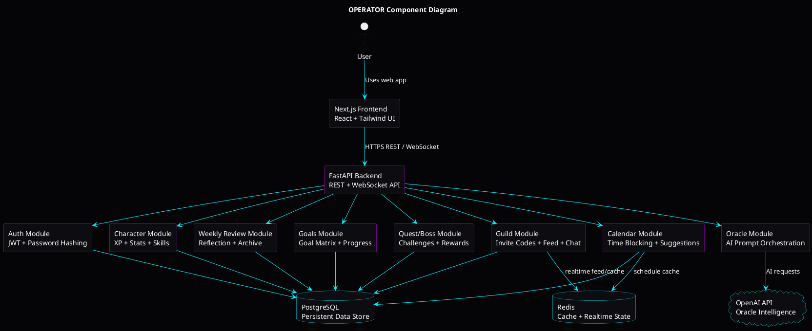
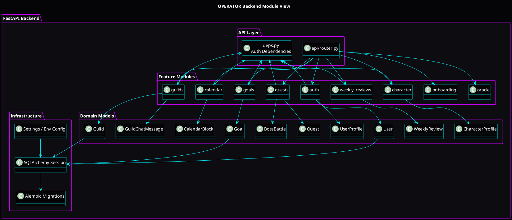
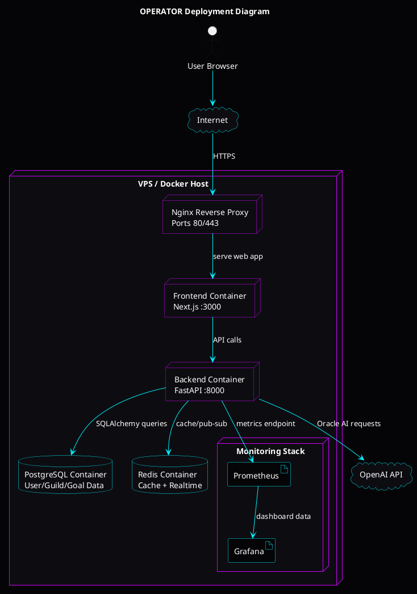
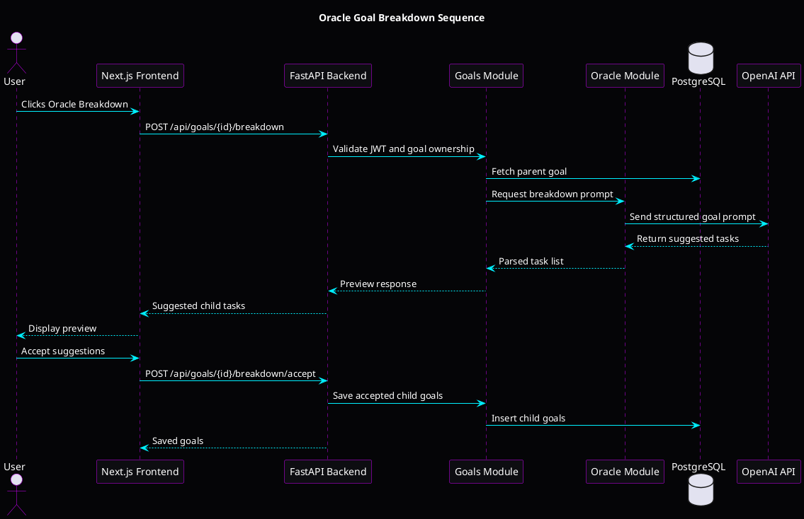

# Architecture Structures and Characteristics

## Project

**Project Name:** OPERATOR / Life Quest

**Project Type:** AI-assisted gamified life-management platform

OPERATOR is a full-stack web application that helps users convert long-term ambitions into daily execution. The system combines goal planning, AI coaching, weekly reviews, smart calendar scheduling, RPG-style XP progression, character stats, achievements, quests, boss battles, and guild accountability.

The platform is built with a Next.js frontend, FastAPI backend, PostgreSQL database, Redis cache/realtime layer, OpenAI Oracle AI integration, and Docker-based deployment.

## 1. Chosen Architectural Style

The chosen architecture is a **Layered Modular Monolith deployed as containerized services**.

Internally, the backend is organized into clear feature modules such as authentication, goals, calendar, character progression, weekly reviews, guilds, quests, and Oracle AI. Externally, the system is deployed as multiple cooperating containers: frontend, backend, PostgreSQL, Redis, and optional monitoring/deployment services.

This architecture is suitable because the project has many related features, but they all revolve around the same user account, goals, progress, and life-management workflow. A full microservices architecture would introduce unnecessary operational complexity at this stage. A modular monolith gives strong organization, easier testing, and simpler deployment while preserving a path toward future service extraction.

## 2. Justification of Architectural Style

### Why Not Pure Microservices?

Microservices are useful when teams and domains are large enough to justify independent deployments. OPERATOR is still a compact product with tightly related modules. Splitting every feature into separate services would increase complexity in service discovery, distributed transactions, inter-service authentication, deployment, and monitoring.

### Why Not Only Layered Architecture?

A simple layered architecture is useful, but OPERATOR has many feature domains. A plain controller-service-database structure could become too broad and hard to maintain. Adding modular boundaries keeps the system organized by business capability.

### Why Modular Monolith Works Best

The modular monolith allows:

- One backend deployment unit.
- Clear internal feature modules.
- Shared authentication and database transaction control.
- Easier debugging and testing.
- Future migration to microservices if traffic or team size grows.

## 3. Architectural Structures

### 3.1 Component View

This view shows the major runtime components and how they communicate.

#### PlantUML Prompt: Component Diagram

### 3.2 Module View

This view shows how the backend is organized internally.

#### PlantUML Prompt: Module Diagram

### 3.3 Deployment View

This view shows how the application is deployed on a VPS or local Docker host.

#### PlantUML Prompt: Deployment Diagram

### 3.4 Data/Request Flow View

This sequence diagram shows a common use case: Oracle goal breakdown.

#### PlantUML Prompt: Sequence Diagram

## 4. Quality Attributes

### Security

Security is important because the system stores personal life goals, reflections, user identity, and guild activity.

Security measures include:

- JWT-based authentication.
- Password hashing.
- Protected backend routes.
- Backend-only OpenAI API key usage.
- Database ownership checks for goals, reviews, guilds, and calendar blocks.
- Invite-code-based private guild joining.
- Moderator controls for guild spaces.

### Scalability

The architecture supports growth through containerized services. The frontend, backend, PostgreSQL, Redis, and monitoring stack can be scaled or tuned independently.

Scalability decisions:

- Docker containers for isolated deployment.
- Redis for realtime and caching expansion.
- PostgreSQL for reliable relational data.
- Kubernetes can later scale frontend/backend replicas.
- AI requests can be rate-limited and cached.

### Maintainability

The backend is separated into business modules. This makes the code easier to understand, test, and extend.

Maintainability decisions:

- Feature modules for auth, goals, calendar, guilds, reviews, quests, and Oracle.
- Alembic migrations for database evolution.
- API helper layer in the frontend.
- Clear domain models.

### Performance

Most requests are simple CRUD operations against PostgreSQL. Redis can reduce load for realtime feed, streaks, and schedule cache.

Performance decisions:

- PostgreSQL indexes on user-owned entities.
- Redis available for future feed caching.
- Frontend state localizes user interaction.
- Oracle AI calls are isolated from normal CRUD flows.

### Reliability

The system uses persistent storage and migration-controlled schema changes.

Reliability decisions:

- PostgreSQL persistent volumes.
- Docker Compose orchestration.
- Health endpoints.
- Future monitoring through Prometheus/Grafana.

### Usability

The interface is designed as a cyberpunk command center with a persistent bottom navigation dock. This supports fast access to Home, Goals, Calendar, Review, Character, and Guild views.

## 5. Trade-Offs

### Simplicity vs Scalability

A modular monolith is simpler than microservices, but individual modules cannot be deployed independently. This is acceptable because the project is still early-stage and benefits more from maintainability than distributed deployment complexity.

### AI Power vs Cost

OpenAI gives strong Oracle responses, but each AI request has cost and latency. The system should use AI for high-value actions such as goal breakdown, weekly review summaries, and schedule suggestions, while using local fallback logic for simple responses.

### Rich Gamification vs Complexity

XP, skills, quests, boss battles, and guilds increase user motivation but also increase business logic complexity. The architecture handles this by placing gamification logic in specific backend modules instead of scattering it across the app.

### Relational Database vs Flexible Documents

PostgreSQL is reliable and consistent for users, goals, guilds, and progress. Some data such as Oracle messages and export settings use JSONB for flexibility. This hybrid approach balances structure and adaptability.

## 6. Pros and Cons of the Chosen Architecture

### Pros

- Easier to develop and debug than microservices.
- Clear backend module separation.
- Strong database consistency with PostgreSQL.
- Dockerized services are suitable for VPS deployment.
- Redis enables future realtime scaling.
- AI integration is protected behind the backend.
- Architecture can evolve toward microservices later.
- Good fit for a student Software Architecture project.

### Cons

- Backend can become large if modules are not maintained.
- One backend deployment affects all backend features.
- Independent scaling of individual modules is limited.
- AI calls may introduce latency and cost.
- PostgreSQL can become a bottleneck if not indexed/tuned.
- Realtime guild chat may require stronger event-driven infrastructure later.

## 7. Analysis and Improvement

### Current Architecture Strengths

- Full-stack separation between frontend and backend.
- Modular backend structure.
- Persistent relational schema.
- Docker-ready deployment.
- AI-assisted feature layer.
- Strong visual identity and product innovation.

### Current Weaknesses

- Some frontend components are still large and should be split.
- True PDF generation for weekly reviews still needs implementation.
- Jenkins, Kubernetes, Ansible, and monitoring need final exam artifacts.
- AI calls need rate limiting.
- Guild chat UI and quest/boss UI need deeper frontend screens.
- Test coverage needs to be increased.

### Recommended Improvements

1. Split frontend views into separate files.
2. Add backend service classes for business logic.
3. Add Pytest backend tests.
4. Add Playwright frontend E2E tests.
5. Add Prometheus metrics endpoint.
6. Add Grafana dashboards.
7. Add Jenkins pipeline.
8. Add Kubernetes manifests.
9. Add Ansible VPS setup playbooks.
10. Add OpenAI rate limiting and request logging.

## 8. Architectural Design Process

### Step 1: Project Description

The system is an AI-assisted life-management platform that helps users plan goals, schedule tasks, reflect weekly, and stay motivated through gamification.

### Step 2: Requirements Identification

Functional requirements include authentication, goal management, Oracle AI assistance, smart scheduling, weekly reviews, XP progression, quests, achievements, boss battles, and guild collaboration.

Non-functional requirements include security, scalability, maintainability, performance, reliability, usability, and deployability.

### Step 3: Component Identification

The major components are frontend, backend, PostgreSQL, Redis, OpenAI API, Docker, Nginx, and monitoring services.

### Step 4: Back-of-the-Envelope Estimation

Initial usage is expected to be 100-500 users. A small VPS with 2-4 vCPU, 4-8 GB RAM, and 50-100 GB SSD storage is enough for the first deployment. AI usage should be controlled with request limits.

### Step 5: Architecture Style Selection

The chosen style is a layered modular monolith deployed as containerized services. This provides the best balance between simplicity, structure, and future scalability.

### Step 6: Architecture Design

The frontend communicates with the backend through REST and WebSocket APIs. The backend modules handle business logic and persist data in PostgreSQL. Redis supports caching and realtime expansion. OpenAI provides Oracle intelligence.

### Step 7: Analysis and Improvement

The architecture is strong for an MVP and academic demonstration. Future improvement should focus on test coverage, CI/CD, monitoring, Kubernetes deployment, Ansible automation, frontend modularization, and AI rate limiting.

