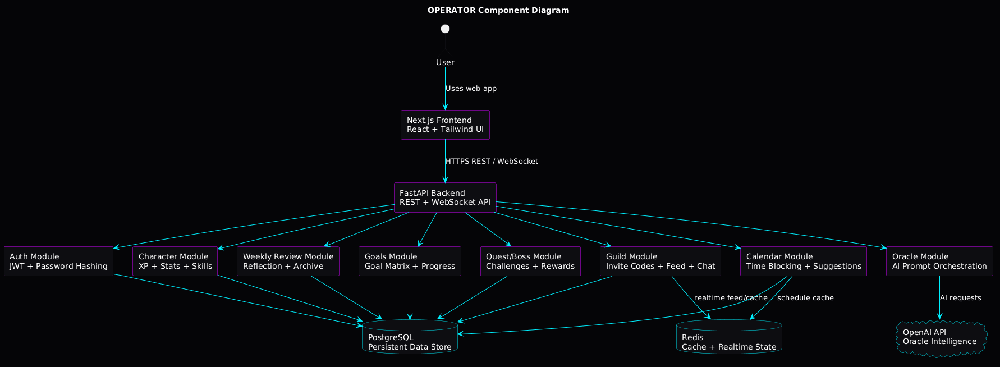
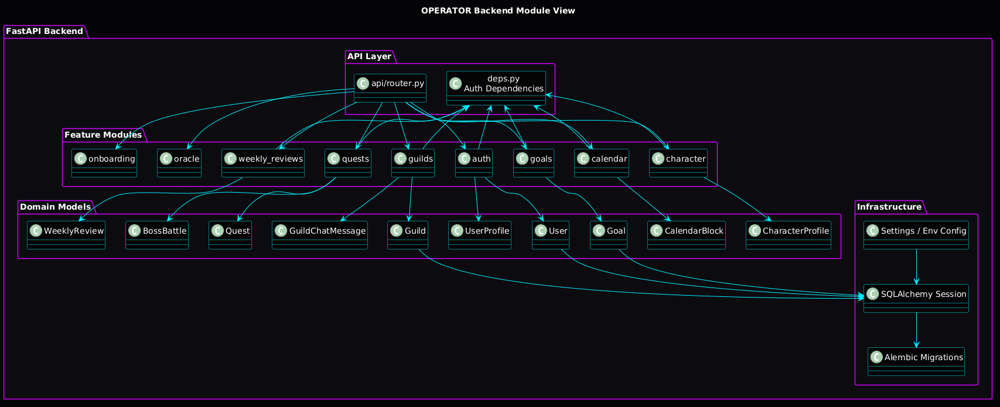
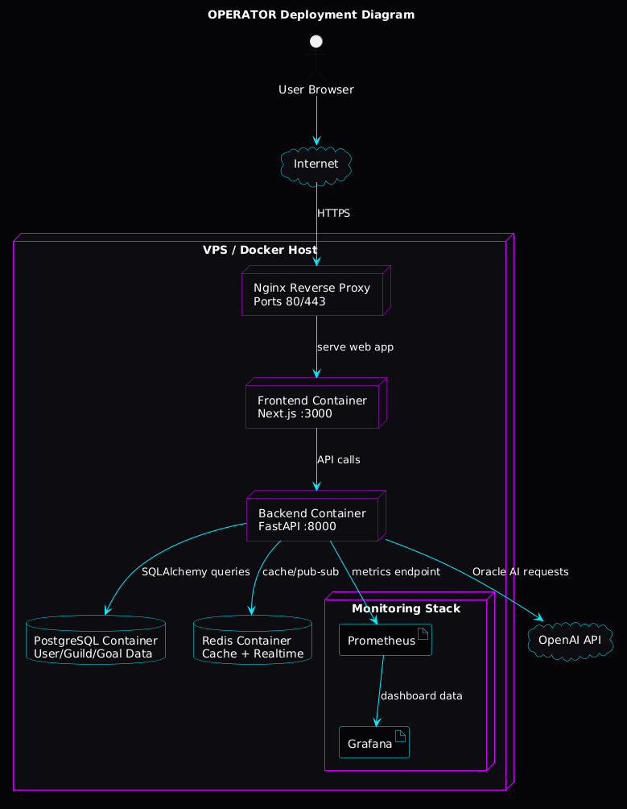
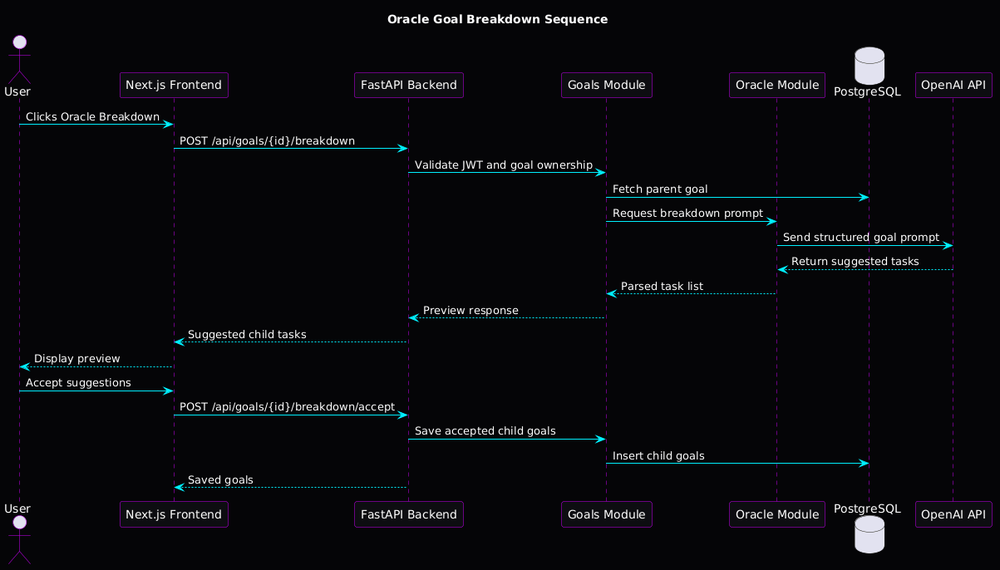

# OPERATOR / Life Quest Final Architecture Report

## Course Section

**Section:** Architecture Structures and Characteristics  
**Project Name:** OPERATOR / Life Quest  
**Project Type:** AI-assisted gamified life-management platform  
**Architecture Style:** Layered Modular Monolith deployed as containerized services

## 1. Project Overview

OPERATOR, also called Life Quest, is a full-stack AI-assisted gamified life-management platform. The system helps users transform broad personal ambitions into structured goals, actionable tasks, weekly reviews, scheduled calendar blocks, RPG-style XP progression, quests, boss battles, and guild accountability.

The application uses a cyberpunk command-center interface where the user acts as an “Operator.” The Oracle AI assistant helps the user break down goals, create schedules, and generate motivational guidance. The platform is designed for students, entrepreneurs, professionals, and self-improvement users who need structure, accountability, and motivation.

## 2. Architecture Style Identification

The selected architectural style is a **Layered Modular Monolith with Service-Oriented Container Deployment**.

The system is modular because the backend is divided into separate business modules such as authentication, onboarding, goals, calendar, Oracle AI, character progression, weekly reviews, quests, boss battles, and guilds. Each module owns a specific part of the business logic.

The system is layered because requests pass through clear layers:

1. Presentation layer: Next.js frontend.
2. API layer: FastAPI routes.
3. Business/domain layer: backend feature modules.
4. Persistence layer: PostgreSQL database.
5. Infrastructure layer: Redis, Docker, Nginx, monitoring, and OpenAI API.

The system is service-oriented at deployment level because the frontend, backend, PostgreSQL, Redis, monitoring stack, and reverse proxy run as separate services or containers.

## 3. Justification of Architecture Style

This architecture was selected because OPERATOR has many features, but those features are closely related around one user identity, one goal system, one progression engine, and one life-management workflow. A microservices architecture would add unnecessary complexity for this project stage.

A modular monolith is more appropriate because it provides:

- Clear separation of business modules.
- Simpler development and debugging.
- Easier local deployment.
- Easier database transaction management.
- Lower operational complexity.
- A future path toward microservices if the system grows.

The architecture also satisfies the project examination requirements because it demonstrates frontend/backend separation, database persistence, AI integration, Docker deployment, monitoring readiness, and clear architectural structures.

## 4. Key Architectural Structures

### 4.1 Component View

The component diagram shows the major parts of the OPERATOR system and how they interact. The user interacts with the Next.js frontend. The frontend communicates with the FastAPI backend through REST and WebSocket APIs. The backend coordinates the internal modules and communicates with PostgreSQL, Redis, and the OpenAI API.

**Explanation:**  
The FastAPI backend is the central application layer. It exposes secure APIs and delegates work to feature modules. PostgreSQL stores persistent data such as users, goals, calendar blocks, weekly reviews, guilds, quests, and achievements. Redis supports caching and realtime features. OpenAI powers Oracle AI intelligence.

### 4.2 Module View

The module view shows how the backend is organized internally. Each feature is implemented as a backend module with its own route logic and domain responsibilities.

**Explanation:**  
The API layer routes requests to feature modules. The dependency layer handles authentication and shared request dependencies. Domain models represent the main data entities, while the infrastructure layer provides configuration, database sessions, and Alembic migrations.

The main backend modules are:

- Auth module
- Onboarding module
- Goals module
- Calendar module
- Oracle module
- Character module
- Weekly Reviews module
- Quests module
- Guilds module

### 4.3 Deployment View

The deployment diagram shows how OPERATOR can be hosted on a VPS or Docker-based production environment.

**Explanation:**  
The user accesses the application through the internet. Nginx acts as a reverse proxy and forwards traffic to the frontend container. The frontend calls the backend API. The backend communicates with PostgreSQL for persistent data, Redis for caching and realtime functions, OpenAI for AI tasks, and Prometheus/Grafana for monitoring.

### 4.4 Sequence View

The sequence diagram shows the Oracle goal breakdown workflow. This is one of the most important AI-powered features in the system.

**Explanation:**  
The user clicks Oracle Breakdown from the frontend. The backend validates the user’s JWT and goal ownership. The goals module fetches the goal from PostgreSQL and sends a prompt request to the Oracle module. The Oracle module calls OpenAI, receives suggested tasks, and returns a preview to the frontend. The user can then accept the suggestions, and the backend saves them as child goals.

## 5. Quality Attributes

### 5.1 Security

Security is important because OPERATOR stores personal goals, weekly reflections, user identity, guild activity, and AI-generated coaching. The architecture improves security by keeping sensitive operations in the backend.

Security characteristics:

- JWT-based authentication.
- Password hashing.
- Protected API routes.
- Backend-only OpenAI API key usage.
- User ownership validation for goals, reviews, calendar blocks, and guild data.
- Invite-code-based guild access.
- Moderator controls for guild activity.

### 5.2 Performance

Most application operations are standard database reads and writes. These are efficient for PostgreSQL, especially with indexes on user-owned records.

Performance characteristics:

- Fast frontend rendering with Next.js.
- Efficient REST endpoints through FastAPI.
- PostgreSQL indexing for user-specific data.
- Redis available for caching and realtime operations.
- AI requests isolated from normal CRUD operations.

### 5.3 Scalability

The system can scale gradually. The frontend and backend can be deployed in separate containers, while PostgreSQL and Redis can be tuned or moved to managed services later.

Scalability characteristics:

- Dockerized services.
- Kubernetes-ready service boundaries.
- Redis support for realtime guild feed and cache.
- Backend can be horizontally scaled behind a load balancer.
- PostgreSQL can be backed up, indexed, and optimized as data grows.

### 5.4 Maintainability

The modular monolith improves maintainability by organizing code according to business features.

Maintainability characteristics:

- Clear backend feature modules.
- Central API router.
- Shared domain models.
- Alembic-controlled database migrations.
- Frontend API helper layer.
- Separation between UI, API, business logic, and persistence.

### 5.5 Reliability

The architecture supports reliability through persistent data storage, containerized deployment, and health-check-ready services.

Reliability characteristics:

- PostgreSQL persistent storage.
- Docker volumes for database data.
- Backend health endpoint.
- Repeatable migrations.
- Monitoring readiness with Prometheus and Grafana.

### 5.6 Usability

The user interface is designed as a dark cyberpunk terminal command center with a persistent bottom navigation dock. This improves navigation and gives the system a strong identity.

Usability characteristics:

- Clear navigation: Home, Goals, Calendar, Review, Character, Guild.
- Oracle terminal for AI guidance.
- Visual XP and character progression.
- Calendar time-blocking interface.
- Weekly review ceremony interface.

## 6. Trade-Off Analysis

### Simplicity vs Independent Scalability

The modular monolith is simpler to build and maintain than microservices. However, individual modules cannot be deployed independently. This is acceptable because the system is still at MVP/project level.

### AI Capability vs Cost

OpenAI integration gives OPERATOR strong AI features, but AI requests can be expensive and slower than normal API calls. The system should use AI for high-value tasks such as goal breakdown, schedule suggestions, and weekly review summaries.

### Strong Consistency vs Flexibility

PostgreSQL gives strong consistency for important data such as users, goals, guilds, and reviews. JSONB fields are used where flexible AI or export settings are needed.

### Rich Gamification vs Business Logic Complexity

XP, skills, quests, achievements, and boss battles improve motivation but add complexity. The architecture manages this complexity by isolating gamification concepts in character, goals, quests, and boss modules.

## 7. Pros and Cons of the Architecture

### Pros

- Easier to build and test than microservices.
- Clear module boundaries.
- Strong fit for a student architecture project.
- Good database consistency through PostgreSQL.
- Dockerized deployment is practical for VPS hosting.
- Redis supports future realtime features.
- OpenAI key is protected on the backend.
- Architecture can evolve into microservices later.

### Cons

- Backend can become large if modules are not maintained.
- A backend failure affects all backend features.
- Individual modules cannot be scaled separately yet.
- AI calls may introduce latency.
- PostgreSQL tuning will become important as data grows.
- Guild chat and realtime features may eventually require event-driven infrastructure.

## 8. Architecture Design Process

### Step 1: Project Description

OPERATOR is an AI-assisted life-management platform that transforms long-term goals into daily execution using Oracle AI, gamification, scheduling, weekly reviews, and guild accountability.

### Step 2: Requirement and Constraint Identification

Functional requirements include authentication, onboarding, goal management, AI goal breakdown, smart scheduling, XP progression, weekly reviews, quests, boss battles, achievements, guilds, and chat.

Non-functional requirements include security, scalability, maintainability, performance, usability, reliability, and deployability.

Constraints include VPS deployment, Docker support, PostgreSQL persistence, OpenAI integration, exam deliverables, and limited project complexity.

### Step 3: Component Identification

The main components are:

- Next.js frontend.
- FastAPI backend.
- PostgreSQL database.
- Redis cache/realtime layer.
- OpenAI API.
- Nginx reverse proxy.
- Prometheus and Grafana monitoring.
- Docker deployment environment.

### Step 4: Back-of-the-Envelope Estimation

Early deployment can support 100-500 users on a small VPS with 2-4 vCPUs, 4-8 GB RAM, and 50-100 GB SSD storage. Normal user actions create small database records, while AI calls are the most expensive operations. AI usage should therefore be rate-limited and used for high-value workflows.

### Step 5: Architecture Style Selection

The selected style is a layered modular monolith with service-oriented container deployment. This gives the project a strong structure while avoiding unnecessary microservice complexity.

### Step 6: Architecture Design

The frontend communicates with the backend API. The backend validates authentication, executes module logic, persists data in PostgreSQL, uses Redis for caching/realtime behavior, and calls OpenAI for Oracle intelligence.

### Step 7: Analysis and Improvement

The current design is suitable for an MVP and academic demonstration. Future improvement should focus on frontend component separation, stronger automated testing, CI/CD with Jenkins, Kubernetes deployment, Ansible automation, Prometheus/Grafana monitoring, OpenAI rate limiting, and true PDF export generation.

## 9. Conclusion

The OPERATOR architecture demonstrates strong architectural thinking through layered separation, modular backend design, containerized deployment, AI integration, and clear quality-attribute trade-offs. The chosen modular monolith is appropriate for the current stage of the project because it provides maintainability and simplicity while still allowing future scalability.

The diagrams show the system from multiple architectural perspectives: component structure, backend module organization, deployment topology, and a key Oracle AI sequence flow. Together, these views provide a complete explanation of how the system is structured, how it behaves, and how it can be improved.

